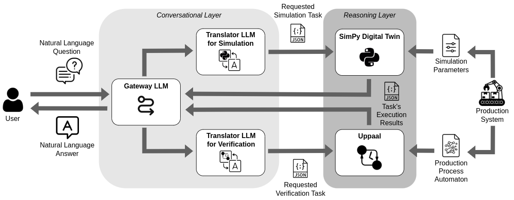

# A Conversational Framework for Faithful Multi-Perspective Analysis of Production Processes

Source code, datasets, and instructions for replicating the experiments of the paper "_A Conversational Framework for Faithful Multi-Perspective Analysis of Production Processes_".

## About

Production systems call for analysis techniques yielding reliable diagnostic and prognostic insights in a timely fashion. To this end, numerous reasoning techniques have been exploited, mainly within the simulation and formal verification realms. However, the technological barrier between these approaches and the target end users remains a stumbling block to their effective adoption. This paper presents a framework interposing a natural language based interface between the interpretation of the user’s request and the reasoning tools. The user’s natural language request is automatically translated into a machine-readable problem. The latter is then dispatched to a proper reasoning engine and either solved through a simulation or a formal verification task, thus enabling a multi-perspective analysis of the production system and certifying the correctness and transparency of the obtained solutions. The outcome is then reprocessed to be human-interpretable. State-of-the-art Large Language Models (LLMs), with their robust capability to interpret the inherent ambiguity of natural language, perform both translations. We evaluate the framework on a lab-scale case study replicating a real production system. The results of the experiments suggest that LLMs are promising complements to derive insights from faithful reasoning engines, supporting accurate analysis.

#### Architecture and pipeline



The Figure shows the components of the framework and how they interact.

The framework is designed to provide grounded and interpretable answers to natural language requests concerning a production process, i.e., the representation of the activities performed within a production system. It achieves this through the integration of a _Conversational Layer_ and a _Reasoning Layer_. The former tackles the formulation of the problem to be fed to the Reasoning Layer and the interpretation of the results in response to the user. The latter exploits either a digital twin simulating the production process or a formal verifier reasoning on its automaton. Therefore, the approach assumes the availability of the simulation parameters and the automaton modeling the production process, provided by a domain expert rather than being LLM-generated to ensure their correctness.

As illustrated in the Figure, the Conversational Layer includes a set of LLMs: the _Gateway LLM_, which routes the user’s questions, and the _Translator LLMs_ for _Simulation_ and _Verification_, which translate these requests into machine-readable representations compatible with the corresponding reasoners' syntax.

## Structure of the repository

```
.
├── models            # Automaton and simulation parameters of the factory
|   └── ...
├── src               # source code of proposed approach
|   ├── uppaal        # source code of the Uppaal verifier
|   └── ...
├── tests             # sources for retrieval evaluation
|   ├── outputs       # outputs of the live convesations
|   ├── test_sets     # test sets employed during the evaluation
|   └── validation    # evaluation results for each run
├── src               # source code of proposed approach
|   └──...
└──...
```

## Getting Started

First, you need to clone the repository:
```bash
git clone https://github.com/angelo-casciani/conv_automata
cd conv_automata
```

Create a new [conda](https://docs.anaconda.com/free/miniconda/) environment:
```bash
conda create -n conv_automata python=3.9 --yes
conda activate conv_automata
```

Run the following command to install the necessary packages along with their dependencies in the `requirements.txt` file using `pip`:
```bash
pip install -r requirements.txt
```

Set up a [HuggingFace token](https://huggingface.co/) and/or an [OpenAI API key](https://platform.openai.com/overview) in the `.env` file in the root directory:
    ```env
    HF_TOKEN=<your token, should start with hf_>
    OPENAI_API_KEY=<your key, should start with sk->
    ```

## LLMs Requirements

Please note that this software leverages the open-source and closed-source LLMs reported in the table:

| Model | HuggingFace Link |
|-----------|-----------|
| meta-llama/Meta-Llama-3-8B-Instruct | [HF link](https://huggingface.co/meta-llama/Meta-Llama-3-8B-Instruct) |
| meta-llama/Meta-Llama-3.1-8B-Instruct | [HF link](https://huggingface.co/meta-llama/Meta-Llama-3.1-8B-Instruct) |
| meta-llama/Llama-3.2-1B-Instruct | [HF Link](https://huggingface.co/meta-llama/Llama-3.2-1B-Instruct)|
| meta-llama/Llama-3.2-3B-Instruct | [HF link](https://huggingface.co/meta-llama/Llama-3.2-3B-Instruct) |
| mistralai/Mistral-7B-Instruct-v0.2 | [HF link](https://huggingface.co/mistralai/Mistral-7B-Instruct-v0.2) |
| mistralai/Mistral-7B-Instruct-v0.3 | [HF link](https://huggingface.co/mistralai/Mistral-7B-Instruct-v0.3) |
| mistralai/Mistral-Nemo-Instruct-2407 | [HF link](https://huggingface.co/mistralai/Mistral-Nemo-Instruct-2407) |
| mistralai/Ministral-8B-Instruct-2410 | [HF link](https://huggingface.co/mistralai/Ministral-8B-Instruct-2410) |
| Qwen/Qwen2.5-7B-Instruct | [HF link](https://huggingface.co/Qwen/Qwen2.5-7B-Instruct) |
| google/gemma-2-9b-it | [HF link](https://huggingface.co/google/gemma-2-9b-it) |
| gpt-4o-mini | [OpenAI link](https://platform.openai.com/docs/models) |

Request in advance the permission to use each Llama model for your HuggingFace account.
Retrive your OpenAI API key to use the supported GPT model.

Please note that each of the selected models have specific requirements in terms of GPU availability.
It is recommended to have access to a GPU-enabled environment meeting at least the minimum requirements for these models to run the software effectively.

## Usage

Run the conversational framework:
```bash
cd src
python3 main.py
```

The complete conversation will be stored in a `.txt` file in the [outputs](tests/outputs) folder.

The default parameters are: 
- LLM: `'Qwen/Qwen2.5-7B-Instruct'`;
- Number of generated tokens: `512`;
- Interaction Modality: `'live'`, i.e., the live chat with the conversational framework.

To customize these settings, modify the corresponding arguments when executing `main.py`:
- Use `--llm_id` to specify a different LLM (e.g., among the ones reported in the _LLMs Requirements_ section).
- Adjust `--max_new_tokens` to change the number of generated tokens.
- Set `--modality` to alter the interaction modality (i.e., `'live'`, `'evaluation-simulation'`, '`evaluation-verification`', and '`evaluation-routing`').

A comprehensive list of commands can be found in `src/cmd4tests.sh`.

## Experiments

### Simulation experiments

To reprodure the experiments for the _simulation_ evaluation, for example:
```bash
cd src
python3 main.py --llm_id Qwen/Qwen2.5-7B-Instruct --modality evaluation-simulation --max_new_tokens 512
```

The results will be stored in a `.txt` file reporting all the information for the run and the corresponding results in the [validation](tests/validation) folder.

### Verification experiments

To reprodure the experiments for the _verification_ evaluation, for example:
```bash
cd src
python3 main.py --llm_id gpt-4o-mini --modality evaluation-verification --max_new_tokens 512
```

The results will be stored in a `.txt` file reporting all the information for the run and the corresponding results in the [validation](tests/validation) folder.

### Routing experiments

To reprodure the experiments for the _routing_ evaluation, for example:
```bash
cd src
python3 main.py --llm_id mistralai/Mistral-7B-Instruct-v0.3 --modality evaluation-routing --max_new_tokens 512
```

The results will be stored in a `.txt` file reporting all the information for the run and the corresponding results in the [validation](tests/validation) folder.

### Generation of New Test Sets

To generate new test sets for the three supported evaluation, run the script `test_sets_generation.py` before running an evaluation.
```bash
python3 test_sets_generation.py
```

## License
Distributed under the GNU GPL License. See [LICENSE](LICENSE) for more information.